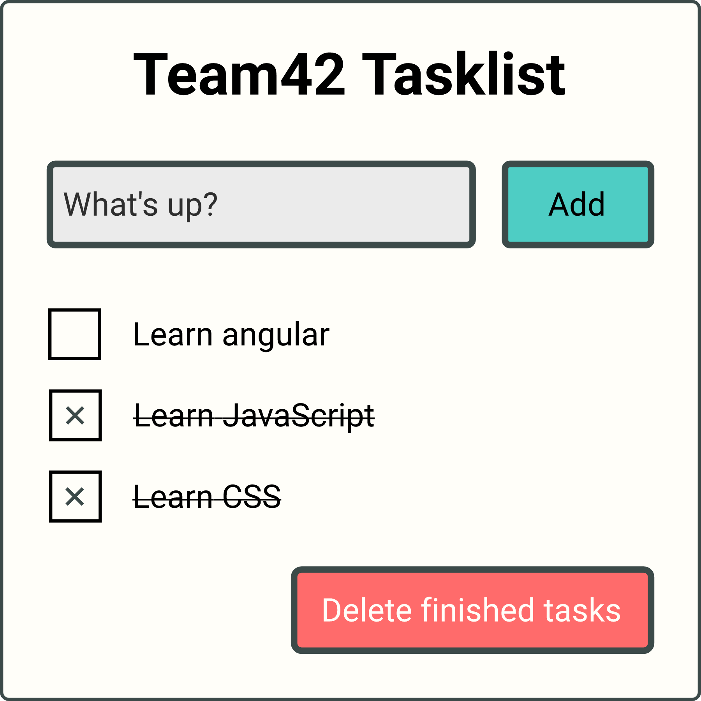

# Angular

## Angular CLI

### Install Angular CLI globally

`npm i @angular/cli`

> If you have Angular CLI installed globally and locally, the local version is used.

### Angular CLI commands

Type `ng` in your console, to see all available commands.

Type `ng <command> --help` to see the help for a specific command.

Visit https://angular.io/cli for the completet command documentation.

### Dry run

For most commands (i.e. `ng new` and `ng generate`) there is a `--dry-run` flag, that will show the potential output.

### Create a new project

Use the `ng new` command to create a new angular project. If you only call `ng new` command, a wizard on the console will guide you through the setup asking for `project name`, `initial routing` and `CSS preprocessor`.

`ng new` command parameters and flags

- `name` as first paramter
- `--prefix=` for component prefix
- `--style=` for CSS preprocessor selection

`ng new wunderlist --prefix=wl --style=scss` will create a new project inside the `wunderlist` folder, with `SCSS` and `wl` as component prefix.

### Generate components

Use `ng generate` to create new pieces of angular code.

To create a new component use this command `ng generate component <path/name>` or use the abbreviation `ng g c`

### Serve

To start developing and serving the project use the `ng serve` command.

## Exercise

We will create a simple task list.

- Use SCSS as preprocessor
- Use `tl` as prefix
- Use a service to manage the tasks
  - Use an abstract class for the service
  - The first version of the service saves the tasklist to the local storage
- make the UI components as dumb as possible
- use normalize.css
- add icons to the buttons
- Add a new task when enter is pressed
- Add a duplicate check (duplicate tasks should be highlighted)
