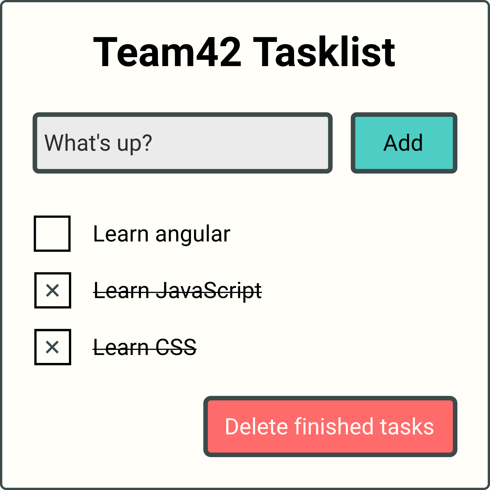

# Tasklist Exercise

We will create a simple task list.

## Requirements

- [ ]  Use SCSS as pre-processor
- [ ]  Use `tl` as prefix
- [ ]  Use a service to manage the tasks
  - [ ] Use an abstract class for the service
  - [ ] Create one version of the service that saves the tasklist to the local storage
- [ ] Make the UI components as dumb as possible
- [ ] Use normalize.css
- [ ] Add icons to the buttons
- [ ] Add a new task when enter is pressed
- [ ] Add a duplicate check (duplicate tasks should be highlighted)
